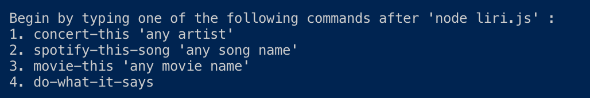
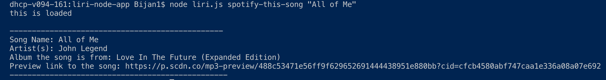
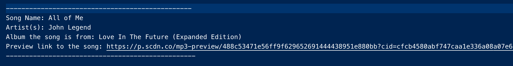
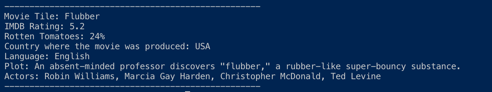
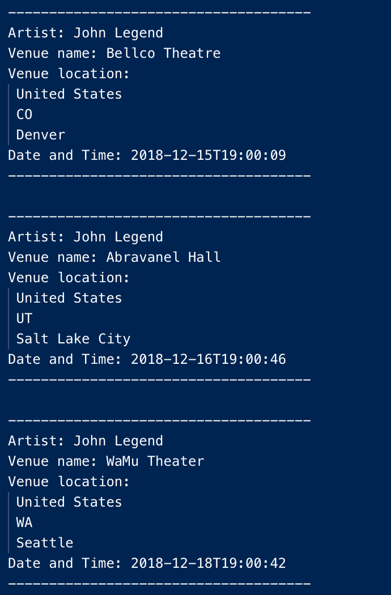
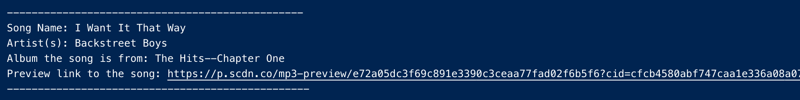

# liri-node-app

## Outline
In this porject we create a CLI in which a user can search Spotify, OMDB, and BandsInTown. 

### Creating Files
1. liri.js
  -Contained main javascript
2. key.js
  -Contained API Keys that were called upon in liri.js
3. random.txt
  -Contained a direction that the do-what-it-says function can read and execute
4. .env
  -Hid our Spotify API in a .env file
5. package.json 
  -Packages installed in this app kept in this file
6. log.txt
  -logs the user input into a separate file
7. .gitignore
  -a serapate file that list all the files I did not want to show in GitHub

### Default 
The default prompt a user will see when `node liri.js` is put in the command line is: 



### Spotify
When using the function spotify-this-song, you can search a song and obtain general info on that song. For intance when 
```
node liri.js spotify-this-song "All of Me"
```
is put in the command line. The following info appears on both the console and log.txt:




### OMDB
When using the function movie-this, you can search a movie and obtain general info on that song. For instance when 
```
node liri.js movie-this "Flubber"
```
is put in the command line. The following info appears on on both the console and log.txt :



### BandsInTown
When using the function concert-this, you can search an artist and obtain three upcoming events. For instance when 
```
node liri.js concert-this "Beyonce"
```
is put in the command line. The following info appears on both the console and log.txt:



### Do What It Says 
When using the function do-what-it-says, you will be reading the text from the file random.txt. In this project this 
random.txt file reads: 

spotify-this-song,"I Want it That Way"

Therefore, when 
```
node liri.js do-what-it-says
```
is put in the command line. The function runs the spotify-this-song command/function and searches for the song 
"I Want it That Way". The following info appears:


  